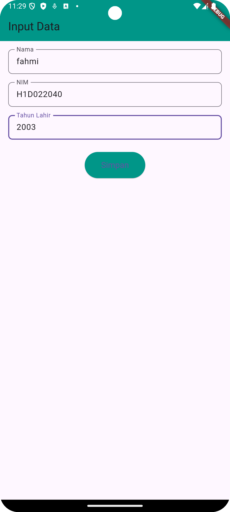
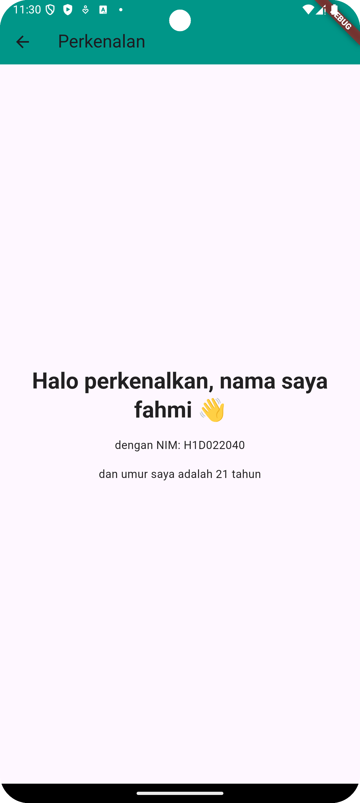

# Tugas Pertemuan 2
Nama : Abdul Aziz Fahmi 'Alauddin

NIM : H1D022040

Shift Baru: Shift E

## Penjelasan

# Passing Data dari Formulir ke Tampilan di Flutter

## Ringkasan
Proyek ini menunjukkan cara membuat formulir di Flutter untuk menangkap input pengguna untuk `Nama`, `NIM`, dan `Tahun Lahir`. Kemudian, data ini diteruskan ke layar lain di mana data input ditampilkan bersama dengan usia yang dihitung.

## Struktur File
- `lib/ui/form_data.dart`: File ini berisi formulir untuk memasukkan `Nama`, `NIM`, dan `Tahun Lahir`.
- `lib/ui/tampil_data.dart`: File ini menunjukkan hasil dari input dari `form_data.dart` dan menghitung usia berdasarkan tahun kelahiran.
- `lib/main.dart`: Titik masuk utama aplikasi.

## Proses Passing Data
1. **Pembuatan Formulir (`form_data.dart`)**:
    - Kami menggunakan `TextEditingController` untuk mengelola input dari kolom teks untuk `Nama`, `NIM`, dan `Tahun Lahir`.
    - Input dari formulir ditangkap ketika pengguna menekan tombol "Simpan".

2. **Meneruskan Data dengan `Navigator`**:
    - Ketika tombol "Simpan" ditekan, data input diteruskan ke `tampil_data.dart` menggunakan konstruktor kelas `TampilData` melalui `Navigator.push`.

3. **Menampilkan Data (`tampil_data.dart`)**:
    - Data diterima di `tampil_data.dart` dan ditampilkan dalam pesan yang diformat. Selain itu, usia dihitung berdasarkan tahun saat ini dan tahun kelahiran input.

## Kustomisasi
Untuk meningkatkan antarmuka pengguna, Anda dapat menambahkan lebih banyak gaya pada kolom formulir dan tampilan hasil. Misalnya:
- Tambahkan padding, margin, dan warna untuk keterbacaan yang lebih baik.

## Screenshots

